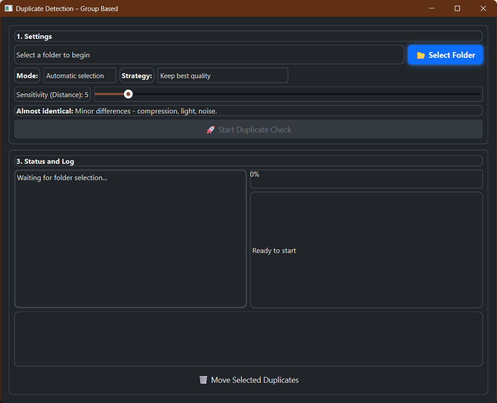

# 🧠 Visual Duplicate Detector

A Python tool for detecting and managing visual duplicates using perceptual hashes and a graphical interface.

> ⚠️ This tool is only compatible with Windows.

---

## 🚀 Features

- 🔍 Detects visual duplicates based on image content  
- 🖼️ GUI for manual review and selection  
- 🧠 Uses perceptual hashes for smarter matching  
- 🗂️ Automatically groups similar images  
- 🧹 Cleans emojis and metadata  

---

## 🗂️ Project Structure

| File | Description |
|------|-------------|
| [config.py](config.py) | Configuration parameters |
| [data_models.py](data_models.py) | Data structures for images and groups |
| [duplicate_gui.py](duplicate_gui.py) | GUI for visual review |
| [file_handler.py](file_handler.py) | File loading and handling |
| [group_match_engine.py](group_match_engine.py) | Group matching logic |
| [image_series.py](image_series.py) | Image series handling |
| [logger_setup.py](logger_setup.py) | Logging setup |
| [match_engine.py](match_engine.py) | Core matching engine |
| [performance_logger.py](performance_logger.py) | Performance logging |
| [styles.py](styles.py) | GUI styling |
| [ui_panels.py](ui_panels.py) | GUI panels |
| [visual_duplicate_checker.py](visual_duplicate_checker.py) | Main application |
| [workers.py](workers.py) | Background processing |
| [.gitignore](.gitignore) | Ignored files configuration |
| [README.md](README.md) | This documentation |

---

## 🖼️ Screenshot

Here’s a preview of the GUI:




## 🛠️ Installation

```bash
pip install -r requirements.txt
python visual_duplicate_checker.py
```

---

## 📌 System Requirements

- Windows 10 or newer  
- Python 3.10+  
- Dependencies listed in `requirements.txt`  

---

## 📄 License

Distributed under the MIT License. See [LICENSE](LICENSE) for details.

---

## 🙏 Credits

Developed by [laashamar](https://github.com/laashamar)  
<<<<<<< HEAD
Contributions and feedback are welcome!

